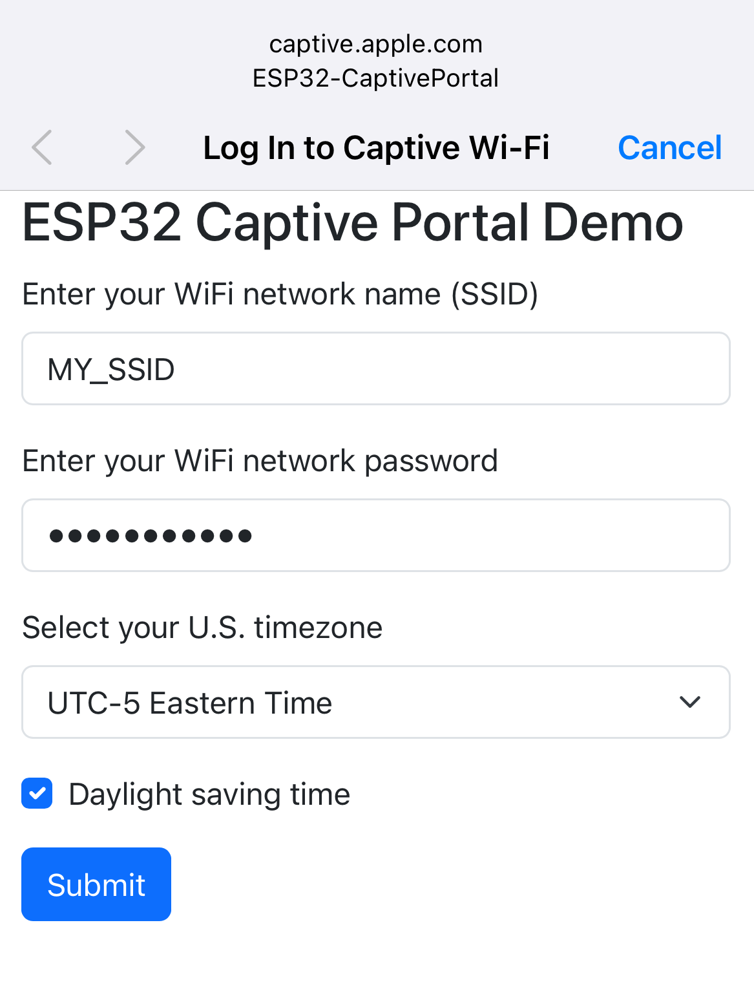
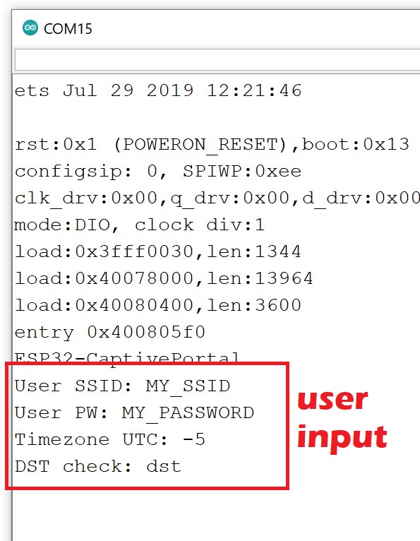

# ESP32-CaptivePortal-Demo

Arduino sketch showcases the use of `DNSServer` and `ESPAsyncWebServer` libraries to implement a captive portal, which is an index.html file stored in ESP32 flash memory via `LittleFS` library. The example portal includes a form which allows users to enter data which then are received by ESP32.

### Sketch and file upload

1. Use Arduino IDE to open `ESP32-CaptivePortal.ino` file.
2. In Arduino IDE, under **Tools** tab select **ESP32 Sketch Data Upload**. It should show a pop-up and then select **LittleFS** to upload files in the `data` folder to ESP32 filesystem.
3. Compile and upload .ino sketch to ESP32 in a regular way.

### Screenshots

The sketch was modified based on the [original captival portal example](https://github.com/me-no-dev/ESPAsyncWebServer/blob/master/examples/CaptivePortal/CaptivePortal.ino) from the `ESPAsyncWebServer` library. 

